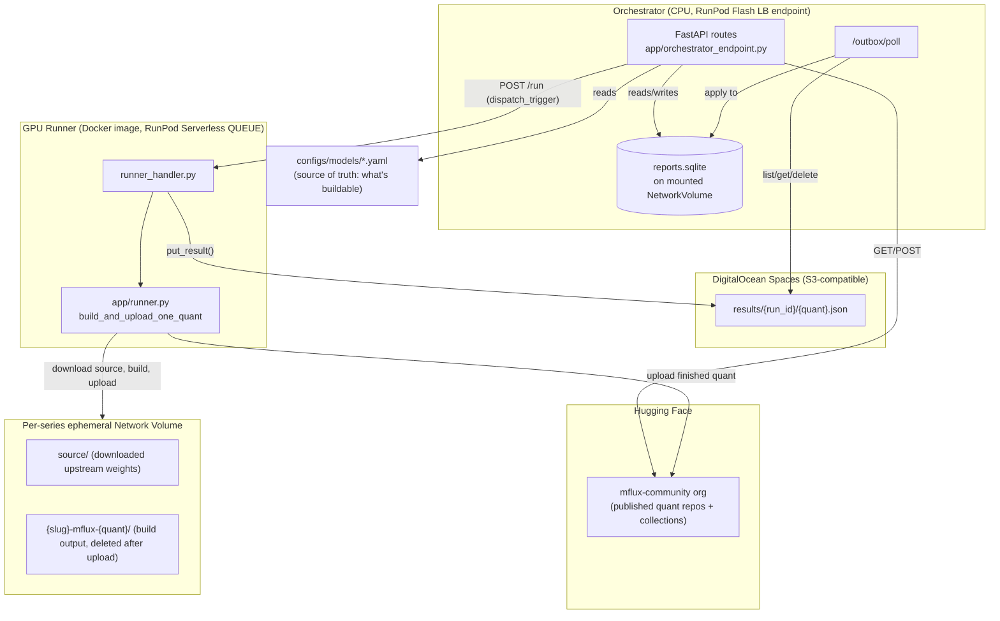
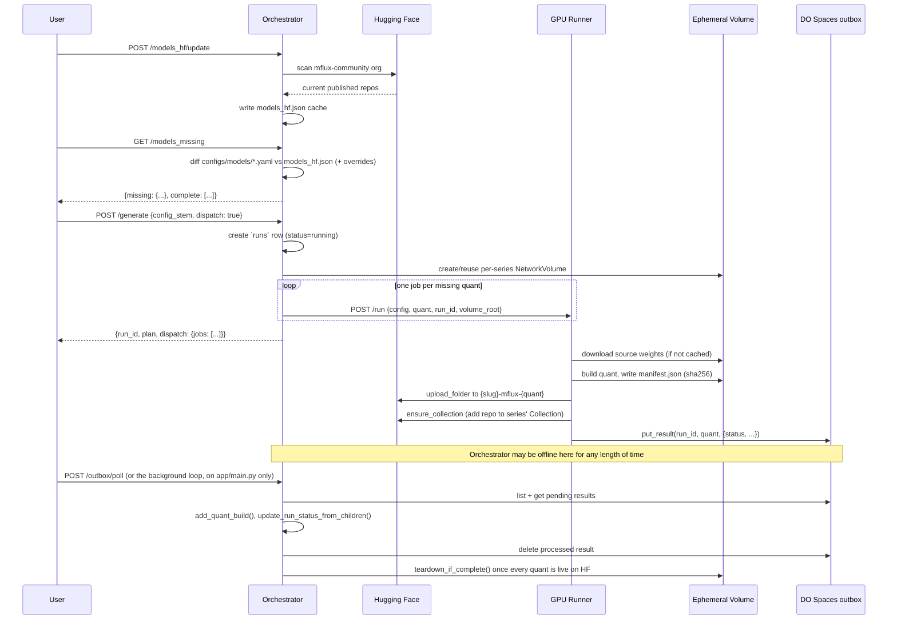

# Architecture

This document describes how `mflux-runpod` actually works today. For the original
design intent see [PRD.md](PRD.md); for build history see [ToDo.md](ToDo.md) and
[docs/](docs/). This file reflects the live system as of 2026-08-19.

## In one paragraph

The **Orchestrator** (CPU, always cheap/idle) knows what quantized MFlux models
*should* exist on the `mflux-community` Hugging Face org, diffs that against what
*does* exist, and dispatches billed GPU work to build the gap. The **Runner** (GPU,
scale-to-zero) does the actual work — one job builds and uploads exactly one
quantized variant of one model. The two never talk to each other directly for
results: the Runner drops its result into a DigitalOcean Spaces bucket (a durable
"outbox"), and the Orchestrator picks it up whenever it next polls. Hugging Face is
the permanent model store; the *per-series* ephemeral RunPod Network Volumes are
purely scratch space that gets deleted once that model series is fully published
(the Orchestrator's own NetworkVolume is persistent — see Storage tiers below).

## Components



### Orchestrator (CPU)

- **Deployed form**: `app/orchestrator_endpoint.py` — a RunPod Flash `Endpoint`
  (load-balanced/Mode 2), named `mflux-orchestrator`, pinned to `EU-RO-1` (Flash's
  CPU endpoints only run there). It's a thin transport layer: every route just
  calls the same functions in `app/*.py` — no logic lives in the Flash wrapper
  itself. Gotcha: only the function body ships to a Flash worker, so imports live
  inside each route, except the `GenerateRequest`/`GenerateAllRequest` Pydantic
  models, which must be module-level for Flash's handler to pass them through
  unwrapped instead of nesting them under a synthesized key.
- **Portable/dev form**: `app/main.py` — a plain FastAPI app exposing the identical
  routes, runnable locally with `uvicorn` (`uv run uvicorn app.main:app --reload`).
  This is also the only place the background outbox-poll loop runs automatically
  (Flash's generated LB lifespan doesn't support a background task) — on the
  deployed Flash endpoint, `/outbox/poll` must be triggered externally (manual
  call, cron, etc).
- **State**: a small SQLite DB (`data/reports.sqlite` locally, or
  `/runpod-volume/reports.sqlite` on the deployed endpoint's mounted
  `NetworkVolume`) holding `runs`, `quant_builds`, and `series_volumes`. The
  Hugging Face manifest cache (`models_hf.json`) lives on the same volume for the
  same reason — without it, a scale-to-zero worker would lose its last HF scan.
- **Never touches a GPU directly.** It plans, records, and dispatches.

### GPU Runner

- **Deployed form**: a plain Docker image (`dockerFiles/runner.dockerfile`) run as
  a RunPod Serverless **QUEUE** endpoint (not Flash-managed) — `mlx[cuda13]` and
  `mflux` are baked into the image at build time, so a cold job installs nothing.
  Entry point is `dockerFiles/runner_handler.py`'s `handler()`, registered via
  `runpod.serverless.start()`.
- **One job = one quant.** A job never builds a whole model series; it builds and
  uploads exactly one quantization of one model. This was a deliberate choice for
  crash isolation and retry granularity — a failed `q8` build doesn't take `q4`
  down with it, and mflux builds are minutes long, so per-job cold start is
  negligible.
- **Actual build/upload logic** lives in `app/runner.py`
  (`build_and_upload_one_quant`), imported by the handler — plain, GPU-free-to-import
  Python so it's unit-testable without mflux or a GPU present. It:
  1. Resolves the model class (`model_object`) and `ModelConfig`
     (`model_config`) named in the series' config.
  2. Builds the quant into the mounted volume, resuming a valid local build via a
     `sha256` manifest check instead of rebuilding from scratch after a crash.
  3. Uploads to `mflux-community/{slug}-mflux-{quant}`, deletes the local build
     directory immediately after a successful upload.
  4. Adds the repo to the series' HF Collection (idempotent — safe even if
     multiple quants' jobs do this concurrently).
- **Per-job overrides**: `force_mlx_ver` / `force_mflux_repo` let a single job pip-install
  a different `mlx`/`mflux` version on top of the baked image (e.g. testing a fork),
  reverting a warm container back to the baked default on the next job that doesn't
  ask for an override.
- Known platform limitation: `mlx>=0.32.0` has a quantized-matmul regression on
  CUDA/Linux, but the image bakes `0.32.0` anyway per explicit project decision —
  see `.claude/learnings/mlx-cuda13-quantized-matmul-bug.md`.

### Durable outbox (DigitalOcean Spaces)

Originally the Runner POSTed its result straight back to the Orchestrator over
HTTP. That was dropped in favor of an S3-compatible **outbox** (`app/outbox.py`)
because a direct callback requires the Orchestrator to be reachable at the *exact
moment* a job finishes — fine for an always-on host, fragile for anything that
might legitimately be offline for a while.

- The Runner (`runner_handler.py`) PUTs a small JSON result to
  `results/{run_id}/{quant}.json` when a job finishes (`outbox.put_result`).
- The Orchestrator processes the outbox on its own schedule
  (`outbox.process_pending`, exposed as `POST /outbox/poll`): lists pending keys,
  applies each result to `quant_builds`/`runs` via `app/report.py`, then deletes
  the object. A malformed object is left in place (not deleted) and reported under
  `errors` so it can be inspected rather than silently lost.
- A result can sit unprocessed for hours or days with zero consequence — that's
  the entire point. Verified live: a job's result sat in the bucket overnight
  with nothing polling it, and the next day's `/outbox/poll` call picked it up
  and applied it correctly.
- Bad/unsubstituted credentials (e.g. a RunPod Secret that doesn't exist yet,
  left as the literal `{{ RUNPOD_SECRET_... }}` string) are caught and converted
  into a clean `OutboxConfigError` → HTTP 503, not a raw 500.

### Storage tiers

| Tier | What lives there | Lifetime |
|---|---|---|
| Hugging Face (`mflux-community` org) | Finished quantized model repos + Collections | Permanent — this **is** the model store |
| Orchestrator's own NetworkVolume (`mflux-orchestrator`, EU-RO-1) | `reports.sqlite`, `models_hf.json` cache | Persistent, survives scale-to-zero |
| Per-series ephemeral NetworkVolume (`mflux-{uuid8}-{series}`, US-IL-1) | Downloaded upstream source weights + in-progress build artifacts | Created on first missing quant for a series, deleted once every quant in that series' config is confirmed live on HF (`app/series_lifecycle.py::teardown_if_complete`) |

### HF-bucket datasets (`app/hf_datasets.py`)

Beyond the finished model repos above, the Orchestrator's own working state —
what's published, what's missing, GPU pricing, event logs, and the build
queue — lives in one shared HF bucket, `hf://buckets/mflux-community/ci`
(write access restricted to the three MFlux admins; that boundary is a
deferred security-audit item, not yet hardened further). Config:
`configs/hf_datasets.yaml` — a sibling of `configs/models/` (the per-model
build configs), not inside it, since `configs/models/*.yaml` is glob-loaded
as buildable models and would otherwise pick this up by accident (confirmed
live 2026-08-19, before this split existed).

| Dataset | Local path | Owner | Notes |
|---|---|---|---|
| `models_mflux` | `data-hf-sync/models_mflux.json` | upstream mflux CI (`writable: false`) | full MFlux-supported catalog; pull-only |
| `models_hf` | `data-hf-sync/models_hf.json` | us — pushed by `update_models_hf` | HF-org scan cache |
| `models_missing` | `data-hf-sync/models_missing.json` | us — pushed by `refresh_models_missing` | snapshot of the live `/models_missing` diff |
| `runpod_gpu_skus` | `data-hf-sync/runpod_gpu_skus.json` | us — pushed by `refresh_gpu_skus` | RunPod GPU pricing, for cost-per-model math |
| `logs/devops.jsonl`, `logs/conversions.jsonl` | `data-hf-sync/logs/*.jsonl` | reserved for future run/quant-build event logs | not yet wired into `app/report.py`'s write path — deferred |
| `models_queue` | `data-hf-sync/models_queue.json` | **DO Spaces is the real master** (`app/queue_store.py`); this bucket copy is a throwaway mirror | human-curated, not derivable from anything else |

Change detection is metadata-only: `huggingface_hub`'s bucket API
(`get_bucket_paths_info`) returns each file's `xet_hash` — a real content
hash — without downloading it, so `POST /datasets/{name}/pull` only pulls
bytes when that hash actually changed (state tracked in
`data/.hf_sync_state.json`). `POST /datasets/{name}/push` uploads the local
file, refused for `models_mflux` (`writable: false`).

The point of all this: local disk is disposable. Lose the volume, `pull()`
every dataset back down, you're whole again — except `models_queue`, whose
actual durability comes from DO Spaces (`POST /models_queue/publish` /
`/restore`), since it's the one dataset that's genuinely authored, not
regenerable.

**Not yet built**: `runs`/`quant_builds` (SQLite) still don't write to
`logs/devops.jsonl`/`logs/conversions.jsonl`, and SQLite isn't yet a
rebuildable read-model replayed from those logs — a deliberately separate
follow-up, not guessed at here. `models_queue`'s actual processing semantics
(granularity, approval, dispatch trigger) are also still undecided — this
layer only wires its persistence.
| DigitalOcean Spaces bucket | Pending job-completion results (`results/{run_id}/{quant}.json`) | Deleted immediately once the Orchestrator successfully applies it |

Ephemeral volumes are sized per series (`app/runpod_volumes.py::size_for_series`)
from the actual upstream HF repo size plus a fixed headroom, rather than one flat
guessed size for every series — some series (e.g. Qwen-Image-Edit) are an order
of magnitude larger than others (e.g. Fibo).

## Config-driven build definitions

`configs/models/*.yaml` is the single source of truth for "what can be built" — a model
present in `data-hf-sync/models_mflux.json` (the full MFlux-supported catalog) but with no
matching `configs/models/{stem}.yaml` is invisible to `/models_missing` and `/generate`,
even though it still shows up under `/models_supported`.

```yaml
# configs/models/Fibo.yaml
model_object: FIBO            # mflux class name, resolved under mflux.models
model_config: fibo            # ModelConfig factory method name
hf_model_name: briaai/FIBO    # upstream source repo on HF
quants: [q4, q6, q8, bf16]
collection:
  name: Fibo
  description: MFlux quantized builds of Fibo
  version: 1.0.0
```

`configs/overrides.yaml` can `force_include` a series into the missing list
regardless of HF state, or `force_exclude` it regardless of missing quants —
used for manual holds (e.g. a series that's broken upstream).

## End-to-end workflow



Key points:

- `generate_one`/`generate_all` (`app/generate.py`) make **zero** RunPod API calls
  themselves — they only plan and write the `runs` row. All billed work (volume
  creation, job dispatch) happens inside `trigger_fn`, which defaults to
  `dry_run_trigger` (a no-op). Real dispatch requires the caller to opt in with
  `dispatch: true`, which swaps in `dispatch_trigger` — a deliberate safety
  boundary so a bare call can never accidentally provision paid resources.
- If a run has nothing to build (everything already published), it's marked
  `success` immediately rather than left `running` forever, since no quant job
  will ever call back to close it out.
- A run's aggregate status is **derived from its children**
  (`update_run_status_from_children`), never trusted from a single job's report —
  N quant jobs report independently against the same `run_id`, so trusting the
  last one to finish would let it silently clobber an earlier failure with its
  own success.
- `dispatch_trigger` requires `RUNNER_ENDPOINT_ID` + `RUNPOD_API_KEY` in the
  Orchestrator's environment; missing either raises a clean `DispatchConfigError`
  → HTTP 503 instead of an unhandled `KeyError`.

## API surface

| Route | Purpose |
|---|---|
| `GET /models_supported` | Full MFlux-supported model catalog (`data-hf-sync/models_mflux.json`) |
| `GET /models_hf` | Cached snapshot of what's published on the `mflux-community` HF org |
| `POST /models_hf/update` | Re-scan the HF org live, refresh the cache |
| `GET /models_missing` | Diff `configs/models/*.yaml` against the HF cache (+ overrides) |
| `GET /model_store` | List active ephemeral per-series RunPod volumes (RunPod's own list is the source of truth, with DB rows used only to label them) |
| `POST /generate` | Plan (and, with `dispatch: true`, actually build) one model series |
| `POST /generate_all` | Same, for every series `/models_missing` currently reports |
| `POST /report/run/{run_id}` | Runner status callback (legacy direct-HTTP path; still supported, but the outbox is the primary path now) |
| `GET /report` | Recent runs + summary stats, or one run's detail (`run_id`), or a series' history (`model_series`) |
| `GET /report/dump` | Unlimited raw dump of every table, for offline inspection |
| `DELETE /report` | Clear `runs` + `quant_builds` (not `series_volumes` — those track real resources) |
| `POST /outbox/poll` | Process every pending DO Spaces result immediately |
| `GET /health` | Liveness check |

## Deployment

- **Orchestrator**: deployed via `flash deploy` from `app/orchestrator_endpoint.py`,
  triggered by `.github/workflows/deploy.yml` on every push to `main`. Flash always
  creates a *new* endpoint rather than updating one in place, so the workflow does
  a clean-slate teardown (delete any existing `mflux-orchestrator`) before
  redeploying — earlier races between overlapping deploy runs caused endpoint
  duplication and even a run that deleted everything and deployed nothing, so the
  workflow now serializes with `concurrency: cancel-in-progress`.
- **GPU Runner**: managed directly via the RunPod API/console as a Docker
  Serverless endpoint, *not* through Flash — it's built from
  `dockerFiles/runner.dockerfile` and pushed to a container registry. Flash's
  `mflux-runner`/`mflux-runner-health` resources have been retired
  (archived under `_deprecated/`), and `deploy.yml`'s clean-slate step keeps those
  names in its defensive delete-set only in case a stray duplicate ever reappears.
- **Datacenter split**: Flash's CPU/load-balanced endpoints only run in `EU-RO-1`
  (hardcoded in `runpod_flash`), while the GPU Runner and its ephemeral volumes
  are pinned to `US-IL-1` (RTX 4090 / ADA_24 availability). This is fine — the
  Orchestrator and Runner don't share a volume, so they don't need to share a
  datacenter.

## Known rough edges

- `ORCHESTRATOR_BASE_URL` (an env var on the Runner) and
  `scripts/sync_runner_orchestrator_url.py` (a `deploy.yml` step keeping it in
  sync with the Orchestrator's ever-changing Flash URL) are **vestigial** —
  they supported the old direct-HTTP callback, which the DO Spaces outbox has
  replaced. Harmless to leave, not yet cleaned up.
- The background outbox-poll loop (`_outbox_poll_loop`, 30s interval) only exists
  in the portable `app/main.py` entrypoint. The actually-deployed Flash endpoint
  has no automatic loop — `/outbox/poll` must be triggered externally.
- `POST /report/run/{run_id}` (the original direct callback route) is still wired
  up and functional on both entrypoints, but is no longer the primary delivery
  path — the Runner writes to the outbox instead.
