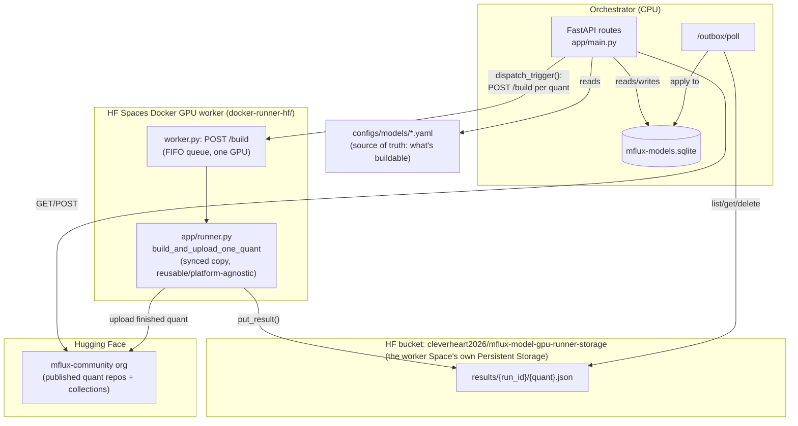
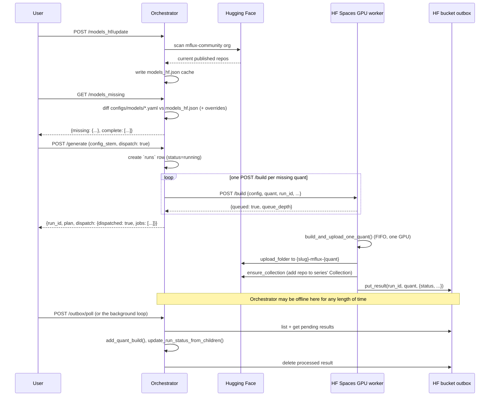

# Architecture

This document describes how `MFlux-Conv` (formerly `mflux-runpod`) actually works today. For the original
design intent see [PRD.md](PRD.md); for build history see [ToDo.md](ToDo.md) and
[docs/](docs/). This file reflects the live system as of 2026-08-20, on the
`hf-gpu-worker` branch: the RunPod-based dispatch layer (Network Volumes, the
Docker Serverless Runner, the Flash-hosted Orchestrator deployment) has been
removed and replaced with a Hugging Face Spaces Docker GPU worker
(`docker-runner-hf/`, a separate repo/deployment). CUDA quantized-matmul
support was verified working on that Space directly (`q3` build of
`flux2-klein-4b`) before this worker was wired up.

## In one paragraph

The **Orchestrator** (CPU, always cheap/idle) knows what quantized MFlux models
*should* exist on the `mflux-community` Hugging Face org, and diffs that against
what *does* exist. `POST /generate {dispatch: true}` now dispatches real GPU
work again: `app/generate.py::dispatch_trigger` POSTs one `/build` request per
missing quant to an HF Spaces Docker GPU worker
(`docker-runner-hf/worker.py`), which builds it and pushes the finished quant
straight back to HF -- the intent was no ephemeral volume anywhere in this
design (unlike the RunPod-based one it replaces, which provisioned a
per-series Network Volume before dispatching), though the worker Space
currently has Persistent Storage attached regardless (see "GPU dispatch"
below -- an open question, not yet reconciled with that intent). The
durable **outbox** pattern (`app/outbox.py`, a small
JSON object per quant result, listed/applied/deleted on the Orchestrator's
own schedule) carried over from the RunPod era conceptually unchanged --
only its backing store moved, from DigitalOcean Spaces to an HF bucket (the
worker Space's own companion bucket). Hugging Face remains the permanent
model store, and as of 2026-08-20 it's also the outbox's store.

## Components



### Orchestrator (CPU)

- **Deployed form**: `app/main.py` -- a plain FastAPI app, runnable locally with
  `uvicorn` (`uv run uvicorn app.main:app --reload`) and mountable behind
  whatever host ends up running it. This used to be mirrored by a second,
  RunPod-Flash-specific entrypoint (`app/orchestrator_endpoint.py`); that file
  was deleted outright when RunPod was removed -- there is currently only one
  FastAPI app, and no deployed hosting target for it yet.
- **Background loops**: `app/main.py`'s own `lifespan` runs the outbox-poll
  loop, the `models_hf`/`models_src_details` refresh loops, and the HF-dataset
  sync loop automatically -- this only happens while this process is actually
  running (`just serve`), not on some separate always-on deployment.
- **State**: a small SQLite DB (`data/mflux-models.sqlite`) holding `runs`,
  `quant_builds`, and the models-catalog master tables (`mflux_catalog`,
  `published_quants`, `source_repos` -- see `app/models_catalog.py`), rebuilt
  on demand from the `data-hf-sync/*.json` caches rather than read from them
  directly. Also still holds `series_volumes` and `dispatched_jobs` -- two
  RunPod-era tables, schema untouched (no migration written), no longer
  written to (the new worker has no per-job id concept -- see "Known rough
  edges").
- **Never touches a GPU directly.** It plans, records, and dispatches over
  HTTP to the worker.

### GPU dispatch (`app/generate.py::dispatch_trigger`)

Requires `HF_WORKER_URL` (the deployed Space's base URL, e.g.
`https://<user>-<space-name>.hf.space`) in the Orchestrator's environment;
`WORKER_API_KEY`, if set, is sent as a Bearer token and must match the
worker's own. Missing `HF_WORKER_URL` raises a clean `DispatchConfigError` ->
HTTP 503, same pattern the RunPod-era version used for its own missing env
vars. `dry_run_trigger` (the default, `dispatch=false`) is unaffected either
way -- planning and DB bookkeeping never touch the worker.

For each quant in `plan["quants_to_build"]` (already filtered to not-yet-
published quants by `generate_one`), `dispatch_trigger` POSTs to the worker's
`/build` with `{config_stem, config, quant, run_id, force_hf_overwrite,
already_published: False}` and moves on immediately -- it does not wait for a
build to finish. The worker's own FIFO queue (one GPU, one job at a time)
serializes actual building; `dispatch_trigger` can queue several quants in a
handful of HTTP round-trips regardless.

`cancel_run` is **not implemented**: the worker has no per-job id or cancel
endpoint (it's a plain in-process queue), and aborting a quant mid-build isn't
something to bolt on without deciding what state that leaves the worker's
local build directory in. `/generate/{run_id}/cancel` always 503s.

### The GPU worker (`docker-runner-hf/`)

A separate git repo (a private Hugging Face Space, `sdk: docker`), not part
of this checkout. Its `app/*.py` is a **synced copy** of four files from this
repo (`__init__.py`, `runner.py`, `models_missing.py`, `outbox.py`) -- kept
current by running `just update-docker-runner` here, then committing +
pushing from `docker-runner-hf/` directly. This mirrors the same pattern
`_deprecated/orchestrator-local`'s (now-removed) `update-orchestrator` recipe
used for a different standalone deployment folder -- an explicit file
allowlist, not a wildcard copy, so nothing Orchestrator- or webapp-only ever
leaks into the worker image.

- **`worker.py`** -- a small FastAPI app (`POST /build`, `GET /status`,
  `GET /health`). `/build` enqueues a job and returns immediately; a single
  background thread pulls from an in-process FIFO queue and calls
  `app.runner.build_and_upload_one_quant()`, then reports the result via
  `app.outbox.put_result()` regardless of success or failure (a failed build
  still posts `{"quant_builds": [{"status": "failed"}], "error": ...}` so the
  run doesn't hang at `running` forever).
- **`app/runner.py`** (`build_and_upload_one_quant`) -- the actual mflux
  build/upload logic, unchanged from before this migration: it never talked
  to RunPod directly, only to a local path (`volume_root`, here
  `BUILD_ROOT=/data/build`). Resolves the model class/`ModelConfig` from the
  config, builds (resuming a valid local build via a `sha256` manifest check
  instead of rebuilding from scratch after a crash), uploads to
  `mflux-community/{slug}-mflux-{quant}`, deletes the local build directory,
  adds the repo to the series' HF Collection.
- **`BUILD_ROOT` (`/data/build`) is NOT plain ephemeral container disk,
  despite the original design intent.** This Space has Persistent Storage
  attached, and `/data` is its mount point -- bucket-backed
  (`cleverheart2026/mflux-model-gpu-runner-storage`, the same bucket the
  outbox uses under a different prefix), billed separately, and survives a
  container restart. `BUILD_ROOT` itself stays there (unchanged, and it has
  at least one confirmed-working build+upload on record).
- **Source weights are deliberately NOT cached on `/data`, decided
  2026-08-20 after trying it and reverting.** `HF_HUB_CACHE` was pointed at
  `/data/hf_hub` to survive restarts without a repeat ~20GB+ download per
  model -- every build attempt after that produced real I/O errors on that
  mount (`RuntimeError: [read] Unable to read 8 bytes from file`, then
  `OSError: [Errno 5] Input/output error` reading even a tiny internal HF
  cache bookkeeping file), while the one build that succeeded (`q3`, before
  this was set) predates it entirely. Reverted: `HF_HUB_CACHE` is unset in
  `docker-runner-hf/Dockerfile`, so mflux's model-loading falls back to its
  default (`~/.cache/huggingface`, genuine ephemeral container disk) --
  trading away cross-restart persistence for actual read reliability, which
  matters more. `/data` may simply not be reliable enough for this
  workload's read/write pattern; not yet tested whether `BUILD_ROOT` itself
  is equally at risk, only that it hasn't failed yet.
- **Required Space secrets**: `HF_TOKEN` (write-scoped, `mflux-community`
  org -- also the outbox credential now, see below) and, optionally,
  `WORKER_API_KEY` (see `docker-runner-hf/README.md`). Set in the Space's
  own Settings -> Variables and secrets, never baked into the image.
- **Hardware**: must be a GPU tier, set in the Space's Settings -- the
  Dockerfile doesn't and can't set this.
- Base image `nvidia/cuda:13.0.1-cudnn-runtime-ubuntu24.04` (same as the old
  RunPod Runner image). `mlx[cuda13]` is installed **without** overriding
  mflux's own `mlx<0.32.0` pin -- the old RunPod image forced `mlx==0.32.0`
  anyway (a known quantized-matmul regression on CUDA/Linux existed at
  >=0.32.0) and paid for it; this image doesn't repeat that.

### Durable outbox (HF bucket, `app/outbox.py`)

A worker POSTing its result straight back to the Orchestrator over HTTP would
require the Orchestrator to be reachable at the *exact moment* a job
finishes -- fine for an always-on host, fragile for anything that might
legitimately be offline for a while. The **outbox** decouples that, and its
design (list/apply/delete on the Orchestrator's own schedule) is unchanged
from the RunPod era -- only its backing store moved. Originally DigitalOcean
Spaces (S3-compatible, boto3); replaced 2026-08-20 with the worker Space's
own companion bucket, `cleverheart2026/mflux-model-gpu-runner-storage`, via
`huggingface_hub`'s bucket API (`batch_bucket_files`/`list_bucket_tree`/
`download_bucket_files`). Confirmed live that this bucket is that Space's
Persistent Storage backing -- the same bucket mounted at `/data` inside the
worker container for build scratch (see `BUILD_ROOT` below) -- so
`results/` is a sibling prefix to `build/`, not a separate resource. Only
credential needed either side is `HF_TOKEN`, already required everywhere
else in this project; no DO Spaces account/credential set needed anymore.

- A worker adds a small JSON result to `results/{run_id}/{quant}.json` when a
  job finishes (`outbox.put_result`).
- The Orchestrator processes the outbox on its own schedule
  (`outbox.process_pending`, exposed as `POST /outbox/poll`): lists pending keys,
  applies each result to `quant_builds`/`runs` via `app/report.py`, then deletes
  the object. A malformed object is left in place (not deleted) and reported under
  `errors` so it can be inspected rather than silently lost.
- A result can sit unprocessed for hours or days with zero consequence -- that's
  the entire point. Verified live (on the DO Spaces version, same design):
  a job's result sat in the bucket overnight with nothing polling it, and the
  next day's `/outbox/poll` call picked it up and applied it correctly.
- Missing `HF_TOKEN` is caught and converted into a clean `OutboxConfigError`
  -> HTTP 503, not a raw 500 -- confirmed live 2026-08-20 on the very first
  real dispatch: the worker's `HF_TOKEN` secret wasn't set yet, and the
  worker logged the dropped result loudly instead of losing it silently or
  crashing.

### Storage tiers

| Tier | What lives there | Lifetime |
|---|---|---|
| Hugging Face (`mflux-community` org) | Finished quantized model repos + Collections | Permanent -- this **is** the model store |
| Orchestrator's local disk | `mflux-models.sqlite`, `models_hf.json` cache | Whatever the deployment target's storage lifetime is -- undecided since RunPod's NetworkVolume-backed deployment was removed |
| Worker's `BUILD_ROOT` (`/data/build`) | Downloaded upstream source weights (via mflux's own HF cache) + in-progress build artifacts | **Not actually ephemeral** -- confirmed live 2026-08-20: `/data` is this Space's Persistent Storage mount (bucket-backed), not plain container-local disk as originally assumed. A failed upload's build directory survives a container restart (found ~4.6GB of exactly this from a failed test build, since cleaned up); the code still deletes it right after a *successful* upload, same as before |
| HF bucket `cleverheart2026/mflux-model-gpu-runner-storage` | Pending job-completion results (`results/{run_id}/{quant}.json`), sibling to `build/` above -- same bucket | Deleted immediately once the Orchestrator successfully applies it |

### HF-bucket datasets (`app/hf_datasets.py`)

Beyond the finished model repos above, the Orchestrator's own working state --
what's published, what's missing, event logs, and the build queue -- lives in
one shared HF bucket, `hf://buckets/mflux-community/ci` (write access
restricted to the three MFlux admins; that boundary is a deferred
security-audit item, not yet hardened further). Config:
`configs/hf_datasets.yaml` -- a sibling of `configs/models/` (the per-model
build configs), not inside it, since `configs/models/*.yaml` is glob-loaded
as buildable models and would otherwise pick this up by accident (confirmed
live 2026-08-19, before this split existed).

| Dataset | Local path | Owner | Notes |
|---|---|---|---|
| `models_mflux` | `data-hf-sync/models_mflux.json` | upstream mflux CI (`writable: false`) | full MFlux-supported catalog; pull-only |
| `models_hf` | `data-hf-sync/models_hf.json` | us -- pushed by `update_models_hf` | HF-org scan cache |
| `models_missing` | `data-hf-sync/models_missing.json` | us -- pushed by `refresh_models_missing` | snapshot of the live `/models_missing` diff |
| `models_src_details` | `data-hf-sync/models_src_details.json` | us -- pushed by `refresh_models_src_details` | per-model upstream source size/hash/date/text-encoder |
| `logs/devops.jsonl`, `logs/conversions.jsonl` | `data-hf-sync/logs/*.jsonl` | reserved for future run/quant-build event logs | not yet wired into `app/report.py`'s write path -- deferred |
| `models_queue` | `data-hf-sync/models_queue.json` | **the GPU worker's HF bucket is the real master** (`app/queue_store.py`, `queue/` prefix -- moved off DO Spaces 2026-08-20, same move as the outbox); this dataset copy is a throwaway mirror | human-curated, not derivable from anything else |
| `models_skipped` | `data-hf-sync/models_skipped.json` | us -- hand-edited | display-only skip rules; never deletes anything, only hides. `/models_available` honors all four rule types (family/sub-family/model/quant). `/models_missing` -- and so the Generate/Queue pages' select lists, which build their options from it -- only honors `skipped_models` (matched by config stem, confirmed live 2026-08-21 after that gap let a skipped model still appear there); `skipped_familys`/`skipped_model_sub_familys`/`skipped_quants` can't be evaluated at that layer (no `models_mflux.json` catalog access -- would create a circular import with `models_catalog.py`) |

Change detection is metadata-only: `huggingface_hub`'s bucket API
(`get_bucket_paths_info`) returns each file's `xet_hash` -- a real content
hash -- without downloading it, so `POST /datasets/{name}/pull` only pulls
bytes when that hash actually changed (state tracked in
`data/.hf_sync_state.json`). `POST /datasets/{name}/push` uploads the local
file, refused for `models_mflux` (`writable: false`).

The point of all this: local disk is disposable. Lose it, `pull()`
every dataset back down, you're whole again -- except `models_queue`, whose
actual durability comes from the HF bucket master (`POST /models_queue/publish` /
`/restore`), since it's the one dataset that's genuinely authored, not
regenerable.

**Not yet built**: `runs`/`quant_builds` (SQLite) still don't write to
`logs/devops.jsonl`/`logs/conversions.jsonl`, and SQLite isn't yet a
rebuildable read-model replayed from those logs -- a deliberately separate
follow-up, not guessed at here. `models_queue`'s actual processing semantics
(granularity, approval, dispatch trigger) are also still undecided -- this
layer only wires its persistence.

## Config-driven build definitions

`configs/models/*.yaml` is the single source of truth for "what can be built" -- a model
present in `data-hf-sync/models_mflux.json` (the full MFlux-supported catalog) but with no
matching `configs/models/{stem}.yaml` is invisible to `/models_missing` and `/generate`,
even though it still shows up under `/models_mflux`.

```yaml
# configs/models/Fibo.yaml
model_object: FIBO            # mflux class name, resolved under mflux.models
model_config: fibo            # ModelConfig factory method name
hf_model_name: briaai/FIBO    # upstream source repo on HF
quants: [q4, q6, q8, bf16]
collection:
  name: Fibo
  description: MFlux quantized builds of Fibo
  version: 1.0.0
```

`configs/overrides.yaml` can `force_include` a series into the missing list
regardless of HF state, or `force_exclude` it regardless of missing quants --
used for manual holds (e.g. a series that's broken upstream).

**Known naming-convention gap** (found 2026-08-20, not yet fixed): the real
repo name a quant gets published under should match the model's
`models_mflux.json` catalog slug (e.g. `flux2-klein-4b`), but
`expected_repo_ids()` (`app/models_missing.py`) still derives it from
`slugify(config["collection"]["name"])` instead -- for `"Flux.2 Klein 4B"`
that produces `flux-2-klein-4b` (extra dash), which doesn't match reality.
24 of 38 configs are affected. A correct fix isn't a blind swap to the
catalog slug: 6 models (`Flux.1-Dev`, `Flux.1-Schnell`, `Krea-2`,
`Z-Image-Base`, `Ideogram-4`, `ERNIE-Image-Base`) already have real published
repos under the *old* collection-name-slug convention, predating
`app/models_catalog.py::resolve_model_slug` (the already-correct resolver
used elsewhere, for `/models_available`). Fixing this needs
`expected_repo_ids` to recognize a series as published under *either*
convention, not just switch which one it computes.

## End-to-end workflow



Key points:

- `generate_one` (`app/generate.py`) makes **zero** dispatch calls itself -- it
  only plans and writes the `runs` row. Real dispatch happens inside
  `trigger_fn`, which defaults to `dry_run_trigger` (a no-op). Real dispatch
  requires the caller to opt in with `dispatch: true`, which swaps in
  `dispatch_trigger` -- a deliberate safety boundary so a bare call can never
  accidentally provision paid resources.
- If a run has nothing to build (everything already published), it's marked
  `success` immediately rather than left `running` forever, since no quant job
  will ever call back to close it out.
- A run's aggregate status is **derived from its children**
  (`update_run_status_from_children`), never trusted from a single job's report --
  N quant jobs report independently against the same `run_id`, so trusting the
  last one to finish would let it silently clobber an earlier failure with its
  own success.
- `dispatch_trigger` requires `HF_WORKER_URL` in the Orchestrator's
  environment; missing it raises a clean `DispatchConfigError` -> HTTP 503.
  `cancel_run` always 503s regardless of environment -- the worker has no
  cancel endpoint (see above).

## API surface

| Route | Purpose |
|---|---|
| `GET /models_mflux` | Full MFlux-supported model catalog (`data-hf-sync/models_mflux.json`) |
| `GET /models_hf` | Cached snapshot of what's published on the `mflux-community` HF org |
| `POST /models_hf/update` | Re-scan the HF org live, refresh the cache |
| `GET /models_missing` | Diff `configs/models/*.yaml` against the HF cache (+ overrides.yaml + models_skipped.json's `skipped_models` rule only -- see the `models_skipped` dataset row above) |
| `POST /models_missing/update` | Materialize the current diff to `data-hf-sync/models_missing.json` and publish it |
| `GET /models_src_details` | Per-model upstream source repo size/hash/date/text-encoder |
| `POST /models_src_details/update` | Rescan every model's upstream source repo and publish the details |
| `GET /models_identity` | Authoritative stem -> catalog slug/family/type/quants resolution |
| `GET /models_available` | `models_mflux.json` x default quants - `models_skipped.json` (informational display list, not a dispatch input) |
| `POST /models_skipped/refresh` | Force-rebuild the catalog mirror and re-read `data-hf-sync/models_skipped.json` |
| `GET /models_queue` | List build-queue entries |
| `POST /models_queue` | Add a model series to the queue |
| `PATCH /models_queue/{entry_id}` | Update a queue entry (`exclude_unset` semantics -- omitted fields untouched, explicit `null` clears) |
| `DELETE /models_queue/{entry_id}` | Remove a queue entry |
| `POST /models_queue/publish` | Save local `models_queue.json` as the HF-bucket master + refresh the HF mirror |
| `POST /models_queue/restore` | Overwrite the local file from the HF-bucket master |
| `GET /datasets` | List the eight HF-bucket datasets + their sync state |
| `POST /datasets/{name}/pull` | Pull one dataset from the bucket if its hash changed |
| `POST /datasets/{name}/push` | Push one dataset's local file to the bucket (refused for `writable: false`) |
| `POST /generate` | Plan (and, with `dispatch: true`, actually build) one model series |
| `POST /generate/{run_id}/cancel` | Cancel a run's in-flight GPU jobs -- always 503s, the worker has no cancel endpoint |
| `POST /report/run/{run_id}` | Worker status callback (direct-HTTP path; the outbox is the primary delivery path) |
| `GET /report` | Recent runs + summary stats, or one run's detail (`run_id`), or a series' history (`model_series`) |
| `GET /report/dump` | Unlimited raw dump of every table, for offline inspection |
| `DELETE /report` | Clear `runs` + `quant_builds` (not `series_volumes` -- a legacy RunPod-era table, not log entries) |
| `POST /outbox/poll` | Process every pending HF bucket outbox result immediately |
| `GET /health` | Liveness check |

## Deployment

- **Orchestrator**: **currently undeployed.** The RunPod Flash deployment
  (`app/orchestrator_endpoint.py`, `flash deploy`, the GitHub Actions
  workflow that built and pushed the RunPod Runner/Orchestrator Docker
  images) has been removed in full, along with the scripts that only existed
  to support it (`scripts/resolve_orchestrator_url.py`,
  `scripts/sync_runner_orchestrator_url.py`). There is no replacement
  deployment target wired up yet -- `app/main.py` runs locally (`just
  serve`) and that's it. To dispatch real work locally, set `HF_WORKER_URL`
  (and `WORKER_API_KEY`, if the worker requires one) before starting it.
- **GPU worker**: a Hugging Face Space, `cleverheart2026/mflux-model-gpu-runner`
  (`docker-runner-hf/`, `sdk: docker`). Built and hosted by HF directly from
  that repo's `Dockerfile` -- no GitHub Actions/GHCR step, unlike the old
  RunPod image. Update its code with `just update-docker-runner` (syncs
  `app/*.py` from this repo), then commit + push from `docker-runner-hf/`
  to trigger a Space rebuild.

## Known rough edges

- `series_volumes` and `dispatched_jobs` (SQLite tables in `app/db.py`) are
  RunPod-era leftovers -- schema kept as-is (no migration written) rather than
  dropped on a branch that may not merge. The new worker has no per-job id
  concept (its `/build` queue is fire-and-forget from the Orchestrator's
  side), so nothing writes to `dispatched_jobs` either; `cancel_run` staying
  unimplemented is a direct consequence of that gap, not a separate issue.
- `ORCHESTRATOR_BASE_URL` (an env var the old RunPod Runner read for its
  direct-HTTP callback) is fully vestigial now that both the env var's
  producer and consumer are gone.
- `POST /report/run/{run_id}` (the original direct callback route) is still
  wired up and functional, but the new worker doesn't call it -- it uses the
  outbox exclusively, same as the RunPod Runner did before it.
- See "Known naming-convention gap" above (`expected_repo_ids` vs.
  `resolve_model_slug`) -- affects what `/models_missing` and `dispatch_trigger`
  think is already published for 24 of 38 configs, independent of anything
  else on this branch.
