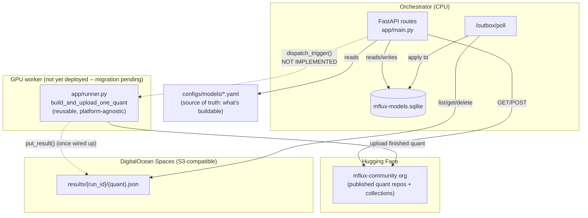
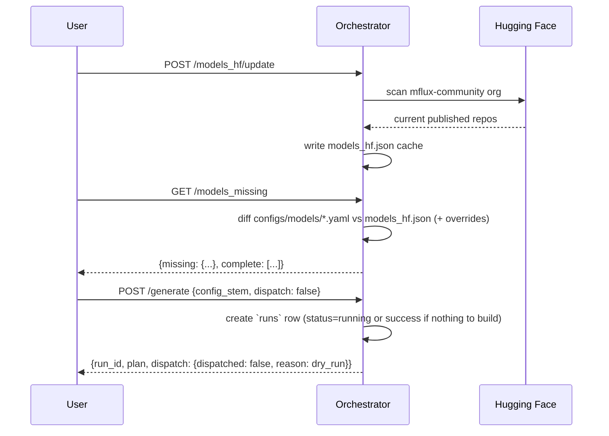

# Architecture

This document describes how `mflux-runpod` actually works today. For the original
design intent see [PRD.md](PRD.md); for build history see [ToDo.md](ToDo.md) and
[docs/](docs/). This file reflects the live system as of 2026-08-20, on the
`hf-gpu-worker` branch: the RunPod-based dispatch layer (Network Volumes, the
Docker Serverless Runner, the Flash-hosted Orchestrator deployment) has been
removed while migrating to a Hugging Face Spaces Docker GPU worker. That
migration itself hasn't landed yet — see "GPU dispatch: currently unimplemented"
below for exactly what that means in practice.

## In one paragraph

The **Orchestrator** (CPU, always cheap/idle) knows what quantized MFlux models
*should* exist on the `mflux-community` Hugging Face org, and diffs that against
what *does* exist. It no longer dispatches GPU work anywhere — the RunPod-based
dispatch mechanism (create a per-series Network Volume, POST a job per quant to
a Docker Serverless Runner) was removed, and its replacement (an HF Spaces
Docker worker, pulling source weights and pushing finished quants straight to
HF with no ephemeral volume in between) hasn't been built yet. `POST /generate`
still plans and records a `runs` row either way; `dispatch=true` currently
always 503s. The durable **outbox** pattern (`app/outbox.py`, a DigitalOcean
Spaces bucket) that lets a GPU worker's result sit unprocessed until the
Orchestrator next polls is unaffected by any of this — it never talked to
RunPod, only to DO Spaces — and is expected to carry over to whatever worker
replaces the Runner. Hugging Face remains the permanent model store.

## Components



### Orchestrator (CPU)

- **Deployed form**: `app/main.py` -- a plain FastAPI app, runnable locally with
  `uvicorn` (`uv run uvicorn app.main:app --reload`) and mountable behind
  whatever host ends up running it. This used to be mirrored by a second,
  RunPod-Flash-specific entrypoint (`app/orchestrator_endpoint.py`); that file
  was deleted outright when RunPod was removed -- there is currently only one
  FastAPI app, and no deployed hosting target for it yet.
- **Background loops**: `app/main.py`'s own `lifespan` runs the outbox-poll
  loop, the `models_hf`/`models_src_details` refresh loops, and the HF-dataset
  sync loop automatically -- this only happens while this process is actually
  running (`just serve`), not on some separate always-on deployment.
- **State**: a small SQLite DB (`data/mflux-models.sqlite`) holding `runs`,
  `quant_builds`, and the models-catalog master tables (`mflux_catalog`,
  `published_quants`, `source_repos` -- see `app/models_catalog.py`), rebuilt
  on demand from the `data-hf-sync/*.json` caches rather than read from them
  directly. Also still holds `series_volumes` and `dispatched_jobs` -- two
  RunPod-era tables, schema untouched (no migration written), currently
  write-only-by-nothing since the code paths that populated them were removed.
- **Never touches a GPU directly.** It plans and records; dispatch is
  currently unimplemented (see below).

### GPU dispatch: currently unimplemented

`app/generate.py::dispatch_trigger` and `cancel_run` both exist as stubs that
immediately raise `DispatchConfigError` (-> HTTP 503 from `/generate` and
`/generate/{run_id}/cancel`). Before removal, `dispatch_trigger` created a
per-series RunPod Network Volume and POSTed one async job per quant to a
RunPod Docker Serverless Runner endpoint; that whole path is gone, not just
disabled. `dry_run_trigger` (the default, `dispatch=false`) is unaffected --
planning and DB bookkeeping still work exactly as before.

What's expected to survive into whatever worker replaces the Runner:

- **`app/runner.py`** (`build_and_upload_one_quant`) -- the actual mflux
  build/upload logic. It never talked to RunPod directly, only to a local
  path (`volume_root`, a plain `Path`), so it's unaffected by the removal.
  Resolves the model class/`ModelConfig` from the series' config, builds into
  local build scratch space (resuming a valid local build via a `sha256`
  manifest check instead of rebuilding from scratch after a crash), uploads to
  `mflux-community/{slug}-mflux-{quant}`, deletes the local build directory,
  adds the repo to the series' HF Collection.
- **The durable outbox** (`app/outbox.py`, DigitalOcean Spaces) -- see below.
  Worker-agnostic; a new worker just needs to call `outbox.put_result()`
  instead of RunPod's old direct-HTTP callback.
- **`app/series_lifecycle.py::series_is_complete`** -- "has every quant in
  this series' config landed on HF" is still the right check for whatever
  build-scratch teardown a new worker needs; only the RunPod-Network-Volume
  half of the old `teardown_if_complete` (deleted, no production caller ever
  existed) is gone.

Known platform risk carried into this migration: `mlx`'s quantized-matmul
support on CUDA/Linux is unreliable (a regression was already hit and worked
around on Modal -- see `.claude/learnings/`), and any HF Spaces GPU tier is
also CUDA/NVIDIA hardware. That needs a direct test before committing further
to an HF Spaces worker; see the discussion this branch was created from.

### Durable outbox (DigitalOcean Spaces)

Originally the Runner POSTed its result straight back to the Orchestrator over
HTTP. That was dropped in favor of an S3-compatible **outbox** (`app/outbox.py`)
because a direct callback requires the Orchestrator to be reachable at the *exact
moment* a job finishes -- fine for an always-on host, fragile for anything that
might legitimately be offline for a while. This is independent of RunPod --
DigitalOcean Spaces, not a RunPod resource -- and is expected to carry over
unchanged to whatever GPU worker replaces the Runner.

- A worker PUTs a small JSON result to `results/{run_id}/{quant}.json` when a
  job finishes (`outbox.put_result`).
- The Orchestrator processes the outbox on its own schedule
  (`outbox.process_pending`, exposed as `POST /outbox/poll`): lists pending keys,
  applies each result to `quant_builds`/`runs` via `app/report.py`, then deletes
  the object. A malformed object is left in place (not deleted) and reported under
  `errors` so it can be inspected rather than silently lost.
- A result can sit unprocessed for hours or days with zero consequence -- that's
  the entire point. Verified live: a job's result sat in the bucket overnight
  with nothing polling it, and the next day's `/outbox/poll` call picked it up
  and applied it correctly.
- Bad/unsubstituted DO Spaces credentials are caught and converted into a
  clean `OutboxConfigError` -> HTTP 503, not a raw 500 (see `app/outbox.py`
  for a historical example of exactly this happening on the since-removed
  RunPod deployment, where a secret template placeholder went unsubstituted).

### Storage tiers

| Tier | What lives there | Lifetime |
|---|---|---|
| Hugging Face (`mflux-community` org) | Finished quantized model repos + Collections | Permanent -- this **is** the model store |
| Orchestrator's local disk | `mflux-models.sqlite`, `models_hf.json` cache | Whatever the deployment target's storage lifetime is -- undecided since RunPod's NetworkVolume-backed deployment was removed |
| GPU worker's build scratch space | Downloaded upstream source weights + in-progress build artifacts | Was a per-series ephemeral RunPod Network Volume (created on first missing quant for a series, deleted once every quant confirmed live on HF); the replacement worker's equivalent (likely local container disk, no separate volume resource -- see the HF Spaces migration discussion) isn't built yet |
| DigitalOcean Spaces bucket | Pending job-completion results (`results/{run_id}/{quant}.json`) | Deleted immediately once the Orchestrator successfully applies it |

### HF-bucket datasets (`app/hf_datasets.py`)

Beyond the finished model repos above, the Orchestrator's own working state --
what's published, what's missing, event logs, and the build queue -- lives in
one shared HF bucket, `hf://buckets/mflux-community/ci` (write access
restricted to the three MFlux admins; that boundary is a deferred
security-audit item, not yet hardened further). Config:
`configs/hf_datasets.yaml` -- a sibling of `configs/models/` (the per-model
build configs), not inside it, since `configs/models/*.yaml` is glob-loaded
as buildable models and would otherwise pick this up by accident (confirmed
live 2026-08-19, before this split existed).

| Dataset | Local path | Owner | Notes |
|---|---|---|---|
| `models_mflux` | `data-hf-sync/models_mflux.json` | upstream mflux CI (`writable: false`) | full MFlux-supported catalog; pull-only |
| `models_hf` | `data-hf-sync/models_hf.json` | us -- pushed by `update_models_hf` | HF-org scan cache |
| `models_missing` | `data-hf-sync/models_missing.json` | us -- pushed by `refresh_models_missing` | snapshot of the live `/models_missing` diff |
| `models_src_details` | `data-hf-sync/models_src_details.json` | us -- pushed by `refresh_models_src_details` | per-model upstream source size/hash/date/text-encoder |
| `logs/devops.jsonl`, `logs/conversions.jsonl` | `data-hf-sync/logs/*.jsonl` | reserved for future run/quant-build event logs | not yet wired into `app/report.py`'s write path -- deferred |
| `models_queue` | `data-hf-sync/models_queue.json` | **DO Spaces is the real master** (`app/queue_store.py`); this bucket copy is a throwaway mirror | human-curated, not derivable from anything else |
| `models_skipped` | `data-hf-sync/models_skipped.json` | us -- hand-edited | display-only skip rules for `/models_available` (family/sub-family/model/quant); never deletes anything, only hides |

Change detection is metadata-only: `huggingface_hub`'s bucket API
(`get_bucket_paths_info`) returns each file's `xet_hash` -- a real content
hash -- without downloading it, so `POST /datasets/{name}/pull` only pulls
bytes when that hash actually changed (state tracked in
`data/.hf_sync_state.json`). `POST /datasets/{name}/push` uploads the local
file, refused for `models_mflux` (`writable: false`).

The point of all this: local disk is disposable. Lose it, `pull()`
every dataset back down, you're whole again -- except `models_queue`, whose
actual durability comes from DO Spaces (`POST /models_queue/publish` /
`/restore`), since it's the one dataset that's genuinely authored, not
regenerable.

**Not yet built**: `runs`/`quant_builds` (SQLite) still don't write to
`logs/devops.jsonl`/`logs/conversions.jsonl`, and SQLite isn't yet a
rebuildable read-model replayed from those logs -- a deliberately separate
follow-up, not guessed at here. `models_queue`'s actual processing semantics
(granularity, approval, dispatch trigger) are also still undecided -- this
layer only wires its persistence.

## Config-driven build definitions

`configs/models/*.yaml` is the single source of truth for "what can be built" -- a model
present in `data-hf-sync/models_mflux.json` (the full MFlux-supported catalog) but with no
matching `configs/models/{stem}.yaml` is invisible to `/models_missing` and `/generate`,
even though it still shows up under `/models_mflux`.

```yaml
# configs/models/Fibo.yaml
model_object: FIBO            # mflux class name, resolved under mflux.models
model_config: fibo            # ModelConfig factory method name
hf_model_name: briaai/FIBO    # upstream source repo on HF
quants: [q4, q6, q8, bf16]
collection:
  name: Fibo
  description: MFlux quantized builds of Fibo
  version: 1.0.0
```

`configs/overrides.yaml` can `force_include` a series into the missing list
regardless of HF state, or `force_exclude` it regardless of missing quants --
used for manual holds (e.g. a series that's broken upstream).

## What currently works end-to-end



`POST /generate {dispatch: true}` and `POST /generate/{run_id}/cancel` are
wired up but both currently return `503 DispatchConfigError` -- no GPU worker
exists to dispatch to or cancel against. The end-to-end build/upload/outbox
sequence (Runner downloads source, builds, uploads, `put_result`s; Orchestrator
polls the outbox and applies it) will come back once a real worker and a real
`trigger_fn` exist.

Key points:

- `generate_one` (`app/generate.py`) makes **zero** dispatch calls itself -- it
  only plans and writes the `runs` row. Real dispatch happens inside
  `trigger_fn`, which defaults to `dry_run_trigger` (a no-op). Real dispatch
  requires the caller to opt in with `dispatch: true`, which swaps in
  `dispatch_trigger` -- a deliberate safety boundary so a bare call can never
  accidentally provision paid resources, now also (incidentally) the reason
  a dry run still works fine with no worker configured at all.
- If a run has nothing to build (everything already published), it's marked
  `success` immediately rather than left `running` forever, since no quant job
  will ever call back to close it out.
- A run's aggregate status is **derived from its children**
  (`update_run_status_from_children`), never trusted from a single job's report --
  N quant jobs report independently against the same `run_id`, so trusting the
  last one to finish would let it silently clobber an earlier failure with its
  own success.
- `dispatch_trigger`/`cancel_run` currently always raise a clean
  `DispatchConfigError` -> HTTP 503, regardless of environment -- there's no
  env var to set that makes real dispatch work right now (see "GPU dispatch:
  currently unimplemented" above).

## API surface

| Route | Purpose |
|---|---|
| `GET /models_mflux` | Full MFlux-supported model catalog (`data-hf-sync/models_mflux.json`) |
| `GET /models_hf` | Cached snapshot of what's published on the `mflux-community` HF org |
| `POST /models_hf/update` | Re-scan the HF org live, refresh the cache |
| `GET /models_missing` | Diff `configs/models/*.yaml` against the HF cache (+ overrides) |
| `POST /models_missing/update` | Materialize the current diff to `data-hf-sync/models_missing.json` and publish it |
| `GET /models_src_details` | Per-model upstream source repo size/hash/date/text-encoder |
| `POST /models_src_details/update` | Rescan every model's upstream source repo and publish the details |
| `GET /models_identity` | Authoritative stem -> catalog slug/family/type/quants resolution |
| `GET /models_available` | `models_mflux.json` x default quants - `models_skipped.json` (informational display list, not a dispatch input) |
| `POST /models_skipped/refresh` | Force-rebuild the catalog mirror and re-read `data-hf-sync/models_skipped.json` |
| `GET /models_queue` | List build-queue entries |
| `POST /models_queue` | Add a model series to the queue |
| `PATCH /models_queue/{entry_id}` | Update a queue entry (`exclude_unset` semantics -- omitted fields untouched, explicit `null` clears) |
| `DELETE /models_queue/{entry_id}` | Remove a queue entry |
| `POST /models_queue/publish` | Save local `models_queue.json` as the DO Spaces master + refresh the HF mirror |
| `POST /models_queue/restore` | Overwrite the local file from the DO Spaces master |
| `GET /datasets` | List the eight HF-bucket datasets + their sync state |
| `POST /datasets/{name}/pull` | Pull one dataset from the bucket if its hash changed |
| `POST /datasets/{name}/push` | Push one dataset's local file to the bucket (refused for `writable: false`) |
| `POST /generate` | Plan (and, with `dispatch: true`, attempt to build) one model series -- `dispatch: true` currently always 503s |
| `POST /generate/{run_id}/cancel` | Cancel a run's in-flight GPU jobs -- currently always 503s, no dispatch mechanism exists to cancel against |
| `POST /report/run/{run_id}` | Worker status callback (direct-HTTP path; the outbox is the primary delivery path) |
| `GET /report` | Recent runs + summary stats, or one run's detail (`run_id`), or a series' history (`model_series`) |
| `GET /report/dump` | Unlimited raw dump of every table, for offline inspection |
| `DELETE /report` | Clear `runs` + `quant_builds` (not `series_volumes` -- a legacy RunPod-era table, not log entries) |
| `POST /outbox/poll` | Process every pending DO Spaces result immediately |
| `GET /health` | Liveness check |

## Deployment

**Currently undeployed.** The RunPod Flash deployment (`app/orchestrator_endpoint.py`,
`flash deploy`, the GitHub Actions workflow that built and pushed the RunPod
Runner/Orchestrator Docker images) has been removed in full, along with the
scripts that only existed to support it (`scripts/resolve_orchestrator_url.py`,
`scripts/sync_runner_orchestrator_url.py`). There is no replacement deployment
target wired up yet -- `app/main.py` runs locally (`just serve`) and that's it,
pending the outcome of the HF Spaces GPU worker migration this branch exists
for.

## Known rough edges

- `series_volumes` and `dispatched_jobs` (SQLite tables in `app/db.py`) are
  RunPod-era leftovers -- schema kept as-is (no migration written) rather than
  dropped on a branch that may not merge, but nothing writes to them anymore.
- `ORCHESTRATOR_BASE_URL` (an env var the old RunPod Runner read) is fully
  vestigial now that both the env var's producer and consumer are gone.
  Harmless to leave mentioned in history, not referenced by any live code.
- `POST /report/run/{run_id}` (the original direct callback route) is still
  wired up and functional, but nothing currently calls it -- there's no
  deployed worker to call it, RunPod's or otherwise.
